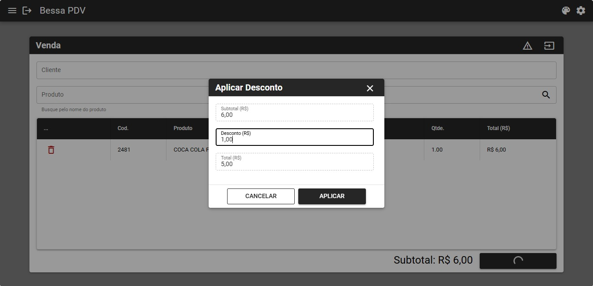
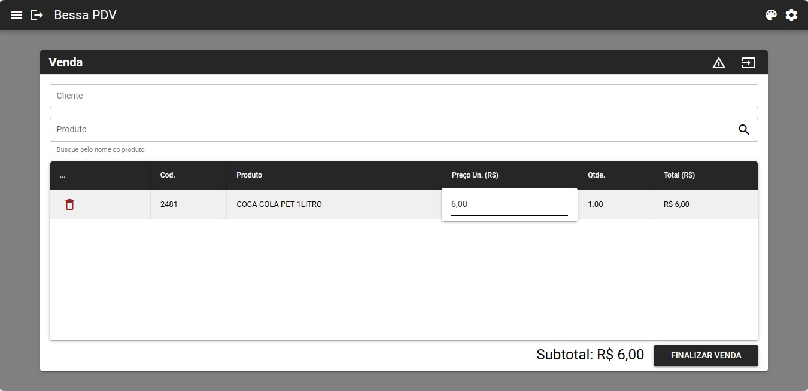
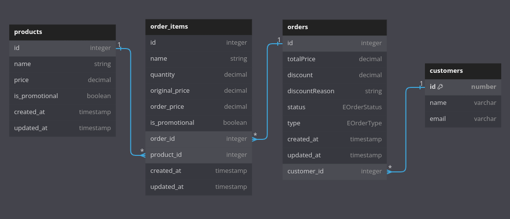

# Exploring Backend - Unit Tests

Project created to exercise the development of unit tests in the team, Exploring Backend - initiative Grão Direto. This project has no presentation layer (like REST APIs or so), database configurations and neither is runnable in its current state. Its sole purpose is to practice unit tests on our last Exploring Backend encounter.

## Install

Install with [npm](https://www.npmjs.com/):

```sh
npm install
```

## Usage

1. Run all tests

   ```sh
   npx jest
   ```

   or with npm test script (package.json)

   ```sh
   npm test
   ```

2. Run specific test file

   ```sh
   npx jest filename.spec.ts
   ```

   or with npm test script (package.json)

   ```sh
   npm test filename.spec.ts
   ```

## Frontend UIs

Images to help understanding usecases motivations

1. Apply Order Discount
   
2. Update Order Item Price
   

## Database Physical Model


